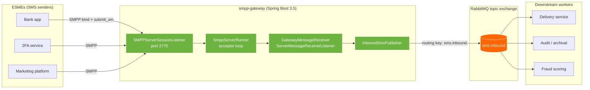
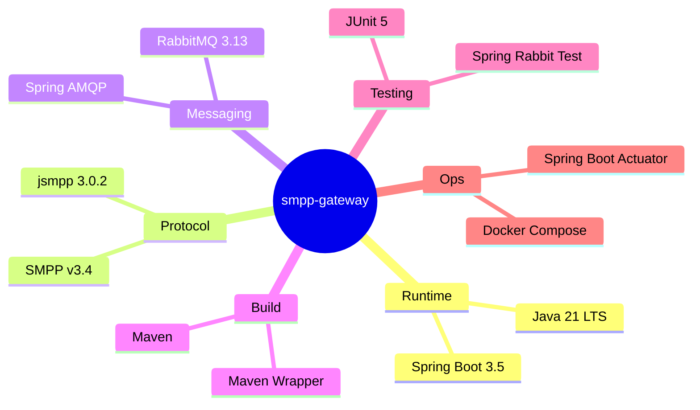
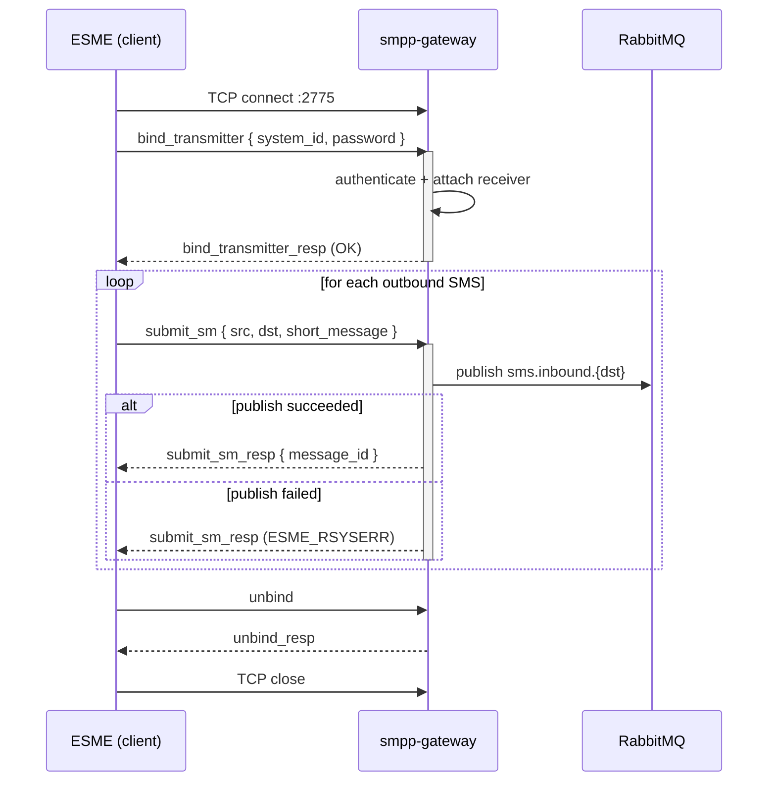

# smpp-gateway

> A Java **SMPP v3.4 server** that accepts `submit_sm` PDUs from ESMEs, publishes each inbound SMS to RabbitMQ, and returns a generated `message_id` — the ESME-facing half of the bridge every telco uses to send and receive SMS.

[](https://openjdk.org/projects/jdk/21/)
[](https://spring.io/projects/spring-boot)
[](https://jsmpp.org/)
[](https://www.rabbitmq.com/)
[](https://smpp.org/)
[](https://www.docker.com/)
[](LICENSE)
[](#status)

---

## What is SMPP and why should you care?

**SMPP (Short Message Peer-to-Peer)** is the binary-over-TCP protocol that sits between:

- **ESMEs** — External Short Messaging Entities: apps, banks, 2FA providers, marketing platforms that _send_ SMS
- **SMSCs / aggregators** — Short Message Service Centers that deliver to the actual carrier network

When your bank sends you an OTP, there is almost certainly an SMPP session somewhere in the chain. TRANSATEL and every other MVNO aggregator runs SMPP endpoints in both directions: inbound from MVNO customers, outbound to MNOs. **This project implements the inbound/ESME-facing side.**

## At a glance



## Features

### Protocol

- **SMPP v3.4** server listening on TCP `2775`
- ESME bind types supported: `TX`, `RX`, `TRX`
- `system_id` / `password` authentication (swap for a real credential store in production)
- Full implementation of `ServerMessageReceiverListener`: `submit_sm`, `submit_multi`, `query_sm`, `replace_sm`, `cancel_sm`, `broadcast_sm`, `cancel_broadcast_sm`, `query_broadcast_sm`, `data_sm`

### Concurrency

- Single-thread **acceptor** that blocks on `SMPPServerSessionListener.accept()`
- Dedicated **session pool** (`Executors.newCachedThreadPool`) so one slow ESME bind doesn't block others
- Configurable PDU **processor degree** via `smpp.processor-degree` (default 4)

### Messaging

- RabbitMQ topic exchange `sms.inbound` with routing key `sms.inbound.<destination-digits>`
- JSON-serialized `InboundSms` record — downstream consumers can filter by destination prefix
- Connection failure rejects the `submit_sm` with `ESME_RSYSERR` — never silently drops

### Ops

- Graceful shutdown via `@PreDestroy` — closes listener, drains session pool
- Spring Boot Actuator at `/actuator/health`
- Lean — no Netty plumbing to reason about, jsmpp NIO is tuned for thousands of sessions out of the box

## Tech stack



## Getting started

### Prerequisites

- Java 21 (Temurin recommended)
- Docker 24+
- An SMPP client to test with (see below)

### Run locally

```bash
git clone https://github.com/soneeee22000/smpp-gateway.git
cd smpp-gateway

# Bring up RabbitMQ (management UI at http://localhost:15672, guest/guest)
docker compose up -d

# Run the gateway (listens on SMPP port 2775, HTTP 8081 for actuator)
./mvnw spring-boot:run
```

### Test with a Python SMPP client

```bash
pip install smpplib
```

```python
import smpplib.client, smpplib.gsm, smpplib.consts

client = smpplib.client.Client("localhost", 2775)
client.connect()
client.bind_transmitter(system_id="gateway", password="gateway")

parts, encoding_flag, msg_type_flag = smpplib.gsm.make_parts(
    "Hello from SMPP!"
)
for part in parts:
    client.send_message(
        source_addr_ton=smpplib.consts.SMPP_TON_INTL,
        source_addr="33612345678",
        dest_addr_ton=smpplib.consts.SMPP_TON_INTL,
        destination_addr="33687654321",
        short_message=part,
        data_coding=encoding_flag,
        esm_class=msg_type_flag,
    )

client.unbind()
client.disconnect()
```

### Verify the message landed

Open the RabbitMQ management UI at [http://localhost:15672](http://localhost:15672) (`guest` / `guest`), head to the `sms.inbound.queue` queue, and click **Get messages**. You should see:

```json
{
  "messageId": "a1b2c3d4e5f6g7h8",
  "sourceAddress": "33612345678",
  "destinationAddress": "33687654321",
  "text": "Hello from SMPP!",
  "systemId": "gateway",
  "receivedAt": "2026-04-24T10:15:00Z"
}
```

## Protocol flow



## Configuration

All settings live in `application.yml` and can be overridden via env vars.

| Property                   | Env var           | Default     | Description                                    |
| -------------------------- | ----------------- | ----------- | ---------------------------------------------- |
| `smpp.port`                | —                 | `2775`      | TCP port for SMPP                              |
| `smpp.processor-degree`    | —                 | `4`         | jsmpp PDU processor threads                    |
| `smpp.bind-timeout-ms`     | —                 | `15000`     | how long to wait for bind PDU after TCP accept |
| `smpp.system-id`           | —                 | `gateway`   | expected ESME system_id                        |
| `smpp.password`            | —                 | `gateway`   | expected ESME password                         |
| `spring.rabbitmq.host`     | `RABBIT_HOST`     | `localhost` |                                                |
| `spring.rabbitmq.port`     | `RABBIT_PORT`     | `5672`      |                                                |
| `spring.rabbitmq.username` | `RABBIT_USER`     | `guest`     |                                                |
| `spring.rabbitmq.password` | `RABBIT_PASSWORD` | `guest`     |                                                |

## Project structure

```
smpp-gateway/
├── docker-compose.yml              # RabbitMQ
├── pom.xml                         # Spring Boot 3.5 + jsmpp 3.0 + AMQP
└── src/main/java/dev/pseonkyaw/smppgateway/
    ├── SmppGatewayApplication.java
    ├── config/SmppProperties.java            # @ConfigurationProperties
    ├── smpp/
    │   ├── SmppServerRunner.java             # acceptor loop + session pool
    │   └── GatewayMessageReceiver.java       # ServerMessageReceiverListener impl
    └── mq/
        ├── RabbitConfig.java                 # exchange + queue + binding
        ├── InboundSms.java                   # DTO (Java record)
        └── InboundSmsPublisher.java          # RabbitTemplate wrapper
```

## Design decisions

| Decision                                                          | Why                                                                                                                                                                                           |
| ----------------------------------------------------------------- | --------------------------------------------------------------------------------------------------------------------------------------------------------------------------------------------- |
| **jsmpp over Cloudhopper**                                        | jsmpp has the largest open-source mindshare and was the protocol library of choice for the `pmoerenhout/jsmpp-sample-spring-boot` reference. Cloudhopper is maintained but Java 8-era.        |
| **Reject non-SUBMIT PDUs with `ESME_RSYSERR`**                    | A real MVNO-facing gateway does not need to handle `replace_sm`, `cancel_sm`, broadcast PDUs, etc. Explicit rejection is clearer than silent drops.                                           |
| **Topic exchange with per-destination routing key**               | Downstream consumers (fraud scoring, archival, per-carrier delivery workers) can bind with selective patterns (`sms.inbound.33*` for French numbers, etc.) without a central routing service. |
| **Graceful shutdown via `@PreDestroy`**                           | `SMPPServerSessionListener.close()` + executor `shutdownNow()` prevents zombie TCP sockets on restart — important when running under Kubernetes.                                              |
| **`ServerMessageReceiverListener` not `MessageReceiverListener`** | The former is the server-side interface jsmpp 3.0 expects; the latter is for outbound/ESME-client roles. Mixing them is a common jsmpp pitfall.                                               |

## Status

Portfolio project — not production. TLS, delivery receipts (`deliver_sm`), rate limiting per ESME, throttling, persistence of in-flight PDUs, and HA session state are out of scope. Built to demonstrate familiarity with the **SMPP protocol** — an explicit nice-to-have on TRANSATEL's Back-End Java JD — and idiomatic Spring Boot composition of a non-HTTP server.

## License

MIT — see [LICENSE](LICENSE).

## Author

**Pyae Sone (Seon)** — [@soneeee22000](https://github.com/soneeee22000) · [linkedin.com/in/pyae-sone-kyaw](https://linkedin.com/in/pyae-sone-kyaw) · [pseonkyaw.dev](https://pseonkyaw.dev)

Paris-based back-end engineer transitioning from Python/TypeScript/AI to JVM back-end for MVNO and core-network work. Dual Master's from Telecom SudParis / Institut Polytechnique de Paris.
